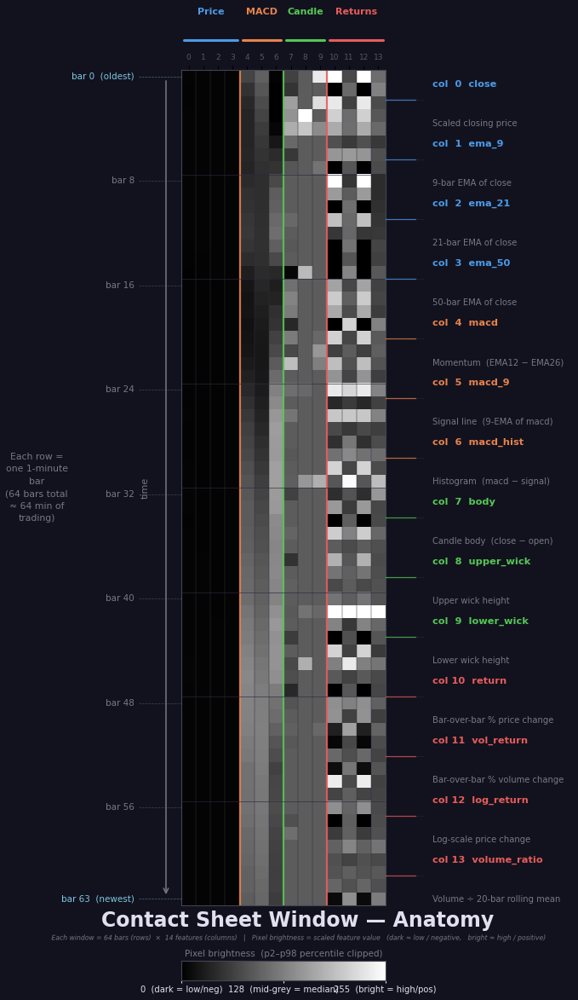
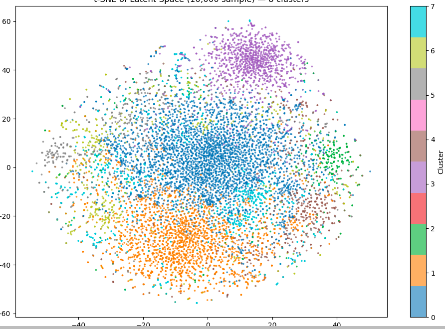
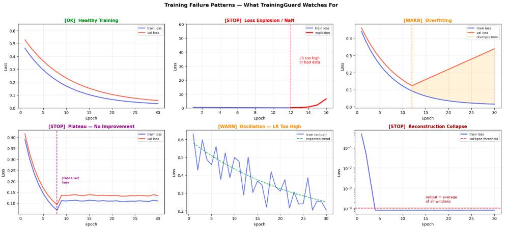

# 1DCNN Autoencoder — Stock Market Analysis

## Visualisations

<table>
<tr>
<td valign="top" width="42%">

</td>
<td valign="top" width="58%">
<br><br>

</td>
</tr>
</table>

---

A two-layer Python project that collects stock market data via the Alpaca Markets API and feeds it into a 1D CNN autoencoder built with PyTorch for pattern detection and anomaly analysis.

---

## Architecture

```
Alpaca Markets API
       │
       ▼
src/alpaca_api/        ← FastAPI data-collection service
  routes/bars.py       ← GET /bars  (OHLCV bar data)
  routes/news.py       ← GET /news  (news articles)
  storage.py           ← saves to MariaDB and/or CSV
  db.py                ← MariaDB connection + table init
       │
       ▼
data/                  ← local CSV store (e.g. TSLA/1Min.csv)
MariaDB (remote)       ← bars + news_articles tables
       │
       ▼
src/1DCNN_A/           ← model notebooks
  1dcnn_a.ipynb        ← 1D CNN autoencoder (main)
  1dcnn_a_learn.ipynb  ← experimentation / learning
```

---

## Data Collection API

The FastAPI service (`src/alpaca_api/`) fetches data from Alpaca and persists it locally.

**Run the server:**
```bash
uv run main.py
# Runs on http://0.0.0.0:8000
```

**Endpoints:**

| Method | Path | Description |
|--------|------|-------------|
| GET | `/bars` | OHLCV bar data for one or more symbols |
| GET | `/news` | News articles for one or more symbols |

**Bar data example:**
```
GET /bars?symbols=TSLA,AAPL&timeframe=1Min&start=2024-01-01&end=2024-12-31&save_to=db,csv
```
- `timeframe`: `1Min`, `5Min`, `1Hour`, `1Day`
- `save_to`: `db`, `csv`, or `db,csv` for both

**News example:**
```
GET /news?symbols=TSLA&start=2024-01-01&end=2024-12-31&limit=50&save_to=csv
```

Interactive docs available at `http://localhost:8000/docs`.

---

## 1D CNN Autoencoder

The notebooks in `src/1DCNN_A/` implement a 1D convolutional autoencoder trained on OHLCV time-series data. The autoencoder learns a compressed representation of normal price action; high reconstruction error signals anomalous market behaviour.

**Launch JupyterLab:**
```bash
uv run jupyter lab
```

---

## Database

MariaDB 10.11 runs via Docker Compose on a remote home server (`192.168.142.174:3306`). The app connects as the `stock_app` user. Tables are created automatically on first startup.

```bash
# Start the database (from mysql/)
cd mysql && docker compose up -d
```

Two tables are managed:
- `bars` — OHLCV data keyed on `(symbol, timeframe, timestamp)`
- `news_articles` — headline, summary, author, URL, and associated symbols

---

## Setup

Requires Python 3.12 and [uv](https://github.com/astral-sh/uv).

```bash
uv sync                  # install dependencies
cp .env.example .env     # fill in Alpaca API keys and DB credentials
uv run main.py           # start the API server
```

**Environment variables** (`.env` at project root):
```
ALPACA_API_KEY=...
ALPACA_SECRET_KEY=...
ALPACA_DATA_BASE_URL=https://data.alpaca.markets
DB_HOST=...
DB_USER=...
DB_PASSWORD=...
DB_NAME=stock_app
DB_PORT=3306
```

---

## Tech Stack

| Layer | Technology |
|-------|-----------|
| Language | Python 3.12 |
| Package manager | uv |
| API framework | FastAPI + Uvicorn |
| HTTP client | httpx |
| Database | MariaDB 10.11 (Docker) |
| DB driver | PyMySQL |
| Data | pandas, numpy |
| Model | PyTorch (`torch<2.3` for macOS Intel) |
| Notebooks | JupyterLab |
| Visualisation | matplotlib, scikit-learn |
